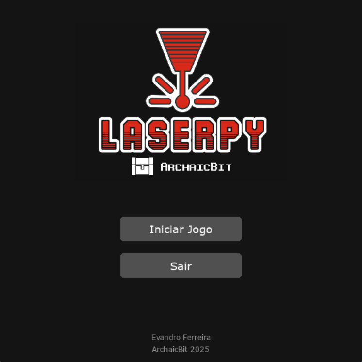
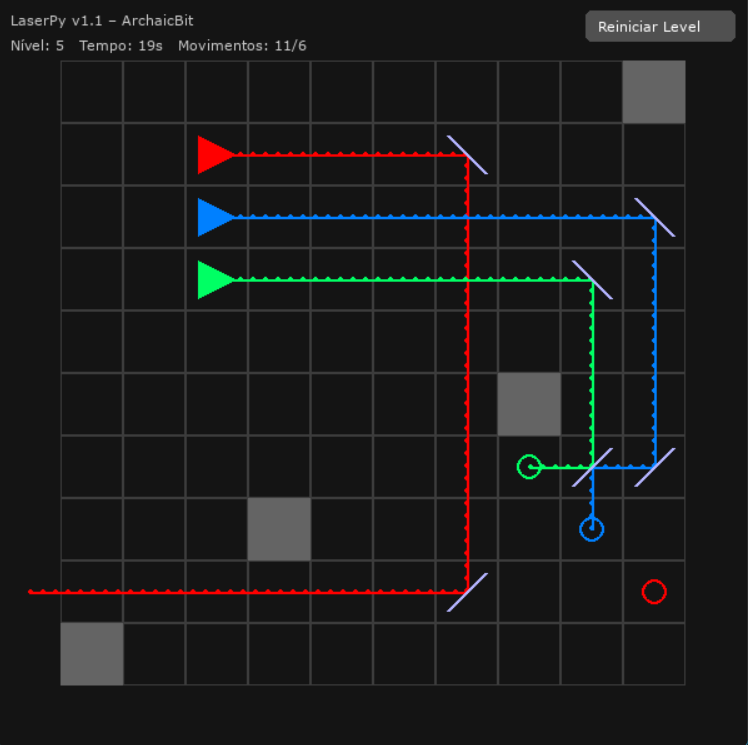

## LaserPy v1.1

**LaserPy** é um jogo puzzle 2D desenvolvido inteiramente com Python, o jogador manipula espelhos para refletir feixes de laser até seus respectivos receptores. Com uma estética retrô e mecânicas simples, o desafio cresce a cada nível, exigindo lógica e estratégia.

## Funcionalidades

- 3 cores de emissores de lasers independentes (vermelho, azul e verde)
- Receptores que só explodem quando atingidos pelo laser da mesma cor
- Espelhos arrastáveis e rotacionáveis para guiar o laser até o receptor
- Níveis progressivamente mais difíceis com paredes, obstáculos e múltiplos elementos
- Animações de impacto, laser e partículas
- GUI com cronômetro, contagem de movimentos e botão de reinício
- Menu inicial com logo e créditos finais

## Como jogar

1. Execute `python laserpy_v1.1.py`
2. No menu inicial, clique em **Iniciar Jogo**
3. Arraste os espelhos com o mouse. Clique duas vezes sobre um espelho para rotacioná-lo
4. Faça com que cada laser atinja o receptor da mesma cor
5. Avance pelos níveis e conclua todos os desafios!

## Controles

| Ação                     | Controle                    |
|--------------------------|-----------------------------|
| Arrastar espelho         | Clique + segurar            |
| Girar espelho            | Clique duplo                |
| Reiniciar nível          | Botão no canto superior     |
| Avançar de nível         | Atingir todos os receptores |

## Requisitos

- Python 3.8 ou superior
- Pygame (`pip install pygame`)

## Screens

## Arquitetura do código

- `laserpy.py`: Código principal do jogo
- `logo_laserpy.png`: Logo exibida no menu
- `docs/`: Screenshots
  
## To-Do / Futuras melhorias

- [ ] Adicionar 10 levels
- [ ] Sistema de pontuação baseado em tempo/movimentos
- [ ] Fazer um hall of fame (local)

## Desenvolvedor

Evandro Ferreira  
[evandrogf.com.br](https://evandrogf.com.br)  
[itch.io](https://archaicbit.itch.io)  
Contato: contato@evandrogf.com.br

## 📄 Licença

Este projeto é open source, com fins didáticos. Distribuído sob a licença [MIT](LICENSE).
